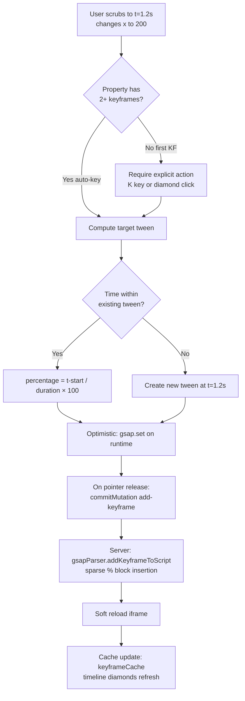
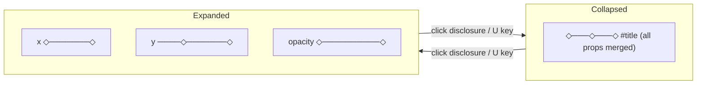
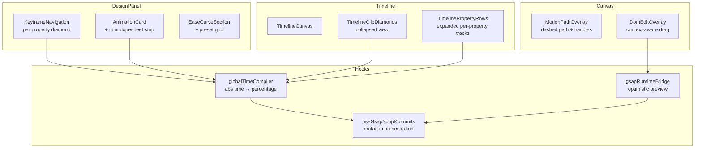

# AE-Level Keyframes for HyperFrames Studio

## Summary

Introduce a global-time, property-first keyframe system to HyperFrames Studio that matches Adobe After Effects' authoring model while preserving GSAP as the sole source of truth. Users scrub to any point in time, change a property, and a keyframe appears — the system compiles global-time intent down to GSAP percentage keyframes transparently. Delivered in three phases: core keyframe loop, easing polish and path visualization, then multi-element coordination with stagger.

---

## Problem Frame

HyperFrames Studio currently exposes GSAP's internal model directly: percentage-based keyframes within a tween's local duration. This creates three friction points that block motion-designer adoption:

1. **Keyframe creation at scrubbed time fails** — scrubbing to t=1.5s on a 0.5s tween produces meaningless percentage values because the computation uses the composition's `data-duration` instead of the tween's duration.
2. **No per-property keyframe independence** — all properties are bundled into the same percentage blocks with shared easing, preventing the independent-per-property curves AE users expect.
3. **No spatial feedback** — no visible motion path, no canvas-direct keyframe creation, no multi-element choreography tools.

The target user is a motion designer switching from AE who expects: scrub → change → keyframe appears, per-property easing, diamond indicators, and multi-select stagger.

---

## Requirements

**Core model**

- R1. The Studio UI presents keyframes in absolute time (seconds), not tween-local percentages. The underlying GSAP code uses percentage keyframes — Studio handles the conversion transparently.
- R2. Each property has an independent keyframe timeline. A keyframe on `x` at t=0.5s does not require `y` to also have a keyframe at t=0.5s. GSAP representation uses sparse percentage blocks within a single tween.
- R3. Flat tweens (no explicit keyframes) auto-display as 2-keyframe animations (start + end) throughout the UI.

**Keyframe creation**

- R4. The first keyframe on a property requires an explicit action (diamond click or `K` shortcut). Once a property has 2+ keyframes, further edits at new scrub times auto-create keyframes.
- R5. Adding a keyframe outside an existing tween's time range creates a new tween rather than extending the existing one. Users can merge tweens by dragging a keyframe into an adjacent clip.
- R6. Canvas manipulation is context-aware: no keyframes → sets static value; on existing keyframe → updates it; property has keyframes + at new time → auto-keys.

**UI indicators**

- R7. A diamond indicator appears next to each keyframeable property in the design panel. Three states: hidden (no keyframes), outlined (keyframed but between keyframes), filled (on a keyframe).
- R8. The Animation section shows a mini dopesheet strip per tween inside each AnimationCard, with clickable diamonds at keyframe positions and selected-keyframe detail below.
- R9. Timeline shows expandable property sub-rows per element. Collapsed view shows merged diamonds; expanded shows per-property diamond tracks.

**Easing and interpolation**

- R10. Preset ease grid plus mini cubic-bezier curve editor for custom easing, reusing the existing `EaseCurveSection`. Full graph editor deferred.
- R11. Two interpolation modes: bezier (default, smooth) and hold (step, no interpolation). Hold keyframes render as square diamonds.

**Properties**

- R12. Curated whitelist of 16 keyframeable properties: `x`, `y`, `scale`, `scaleX`, `scaleY`, `rotation`, `opacity`, `backgroundColor`, `color`, `borderColor`, `borderRadius`, `clipPath`, `filter`, `boxShadow`, `width`, `height`.

**Multi-element**

- R13. Multi-select elements and add/edit keyframes on all simultaneously. Stagger supported via numeric offset input and drag-to-fan interaction, with order modes (DOM, reverse, center-out, random).
- R14. Copy/paste keyframes between elements — serializes a property's keyframe array and applies it to the target element's tween.

**Timeline interaction**

- R15. Smart snapping: keyframes snap to frame boundaries (at composition FPS), cross-element keyframes, and audio beat markers. `Cmd` held disables snapping.
- R16. Keyboard shortcuts mirror AE conventions: `K` add keyframe, `J`/`Shift+J` prev/next, `H` toggle hold/bezier, `U` expand/collapse property rows, arrow keys nudge keyframes in time.

**Motion path**

- R17. When an element with x/y keyframes is selected, its motion path renders on canvas as a dashed line. Direct path editing (drag path to adjust curviness) connects to existing MotionPath integration.

**Preview and sync**

- R18. During drag/edit operations, canvas updates optimistically via direct GSAP runtime manipulation. Code is written once on pointer release. One interaction = one undo point.

---

## Key Technical Decisions

KTD-1. **GSAP remains sole source of truth**: No new JSON keyframe format. Studio reconstructs the global-time view by parsing GSAP calls (tween start time + duration + percentage = absolute time). The parser already extracts `position`, `duration`, and `keyframes` — the conversion is pure arithmetic.

KTD-2. **Sparse percentage blocks in a single tween per element**: Per-property independence is achieved by allowing keyframes to contain only the properties that change at each time. GSAP interpolates between the percentage blocks that contain a given property (it does NOT hold values — properties missing from a block are simply skipped). This means the existing `backfillDefaults` parameter in `addKeyframeToScript` is required: when a keyframe introduces a property absent from other keyframes, default values must be backfilled so GSAP has values to interpolate between. This avoids splitting into multiple tweens per property, which would complicate the parser, undo system, and timeline display.

KTD-3. **New tween creation outside bounds**: When a keyframe is placed outside any existing tween's time range, a new tween call is added to the script via a new `add-with-keyframes` mutation. Merge-via-drag is a timeline UI operation that moves keyframes between tween clips.

KTD-4. **Optimistic runtime preview**: During drag/edit, the live GSAP instance in the iframe is manipulated directly via `gsap.getProperty` / `gsap.set` on the runtime bridge. No script writes until pointer release. This matches the existing drag intercept pattern in `gsapRuntimeBridge.ts`.

KTD-5. **Global-time ↔ percentage conversion lives client-side**: The conversion between absolute time and percentage is pure math (`percentage = (absoluteTime - tweenStart) / tweenDuration * 100`) and runs in Studio hooks/components, not in the server-side parser. The parser continues to work with percentages internally.

KTD-6. **Extend `KeyframeNavigation` for diamond indicators**: The existing component already implements the three-state diamond (ghost/inactive/active) with prev/next arrows per property. It will be extended to all keyframeable properties in the design panel, not just the Layout section.

KTD-7. **Beat marker snapping requires onset detection**: Audio beat snapping (Phase 3) needs an onset detection library. The choice (aubio.js, Meyda, essentia.js, or Web Audio API `AnalyserNode`) is deferred to implementation — the snapping engine's interface accepts an array of beat times regardless of source.

---

## High-Level Technical Design

### Data flow: user action → GSAP code



### Timeline expandable property rows



### Component architecture



---

## Scope Boundaries

### In scope

- Global-time keyframe model with percentage compilation
- All locked UX decisions from the brainstorming session (20 decisions across Questions 1-23)
- Three-phase delivery (core → polish → multi-element)

### Deferred to follow-up work

- Full graph editor (value-over-time curves with multi-keyframe handle editing)
- Ghost frames / onion skinning
- Expression system / linked property values
- Keyframe presets library
- 3D transform keyframing (z, rotationX/Y/Z)

### Prerequisites

- Gesture recording position fix (plan `2026-06-07-004`) should land first — it establishes the `gsap.getProperty()` baseline pattern that this work extends.

---

## Risks & Dependencies

- **Parser complexity**: Adding an `add-with-keyframes` mutation type to `gsapParser.ts` (already 1910 lines) increases parser surface. Mitigated by following the existing `locateAnimation` + recast pattern and adding test coverage for the new path.
- **Keyframe cache additive-only invariant**: Three cache-clearing bugs were previously fixed. New features must not introduce clearing paths for runtime-scanned entries. Mitigated by explicit test scenarios.
- **Animation ID stability across conversions**: When `convertToKeyframesInScript` changes a `from()` to `to()`, the ID changes. The regex fallback handles this, but new tween creation paths must also produce stable, predictable IDs. Mitigated by following `assignStableIds` conventions.
- **Beat marker snapping library**: Phase 3 depends on an audio analysis library for onset detection. If none meets the size/quality bar, beat snapping degrades to manual marker placement.

---

## Phase 1 — Core Keyframe Loop

### U1. Global-time ↔ percentage compiler hook

**Goal:** Provide utility functions that convert between absolute time (seconds) and tween-local percentages, enabling all downstream UI to work in absolute time.

**Requirements:** R1, R2

**Dependencies:** None

**Files:**
- Create `packages/studio/src/utils/globalTimeCompiler.ts`
- Modify `packages/studio/src/hooks/useGsapTweenCache.ts` — extend cache entries with `tweenStart` and `tweenDuration` fields
- Test `packages/studio/src/utils/globalTimeCompiler.test.ts`

**Approach:** Pure utility functions that accept `GsapAnimation[]` as a parameter (callers pass in the animations they already hold from cache reads). Functions:
- `absoluteToPercentage(time, animation) → number` — clamps to [0, 100]
- `percentageToAbsolute(pct, animation) → number`
- `isTimeWithinTween(time, animation) → boolean`
- `findTweenAtTime(time, animations, selector) → GsapAnimation | null`

These are stateless transformations — no React hook needed. Consistent with the existing `computeCurrentPercentage` pattern in `gsapRuntimeBridge.ts`. Cache entries are extended to include `tweenStart` and `tweenDuration` derived from `position` and `duration` on the `GsapAnimation`.

When `GsapAnimation.position` is a string label (e.g., `"+=0.5"`, `"myLabel"`), the static arithmetic is undefined. Fallback: read `tween.startTime()` from the runtime via the `RuntimeTween` interface in `gsapRuntimeKeyframes.ts`. This gives the resolved absolute start time regardless of how the position was specified in code.

**Patterns to follow:** `computeCurrentPercentage` in `gsapRuntimeBridge.ts` for the existing percentage math pattern.

**Test scenarios:**
- Keyframe at t=0.5s within a tween starting at 0s with duration 2s → 25%
- Keyframe at t=1.0s within a tween starting at 0.5s with duration 1s → 50%
- Time before tween start clamps to 0%
- Time after tween end clamps to 100%
- `findTweenAtTime` returns null for gaps between tweens
- `findTweenAtTime` returns the correct tween when multiple tweens exist for the same selector
- Handles tweens with string position labels by falling back to `tween.startTime()` from the runtime
- Falls back gracefully when iframe is not loaded (returns null for unresolvable positions)

**Verification:** Unit tests pass. The utility module is importable from Studio components without pulling in server-side parser code.

---

### U2. Flat tween auto-display as 2-keyframe animations

**Goal:** Make every flat tween (no explicit `keyframes:{}`) appear throughout the UI as having a start keyframe (0%) and end keyframe (100%), so the entire system treats all tweens uniformly.

**Requirements:** R3

**Dependencies:** U1

**Files:**
- Modify `packages/studio/src/hooks/gsapRuntimeKeyframes.ts` — ensure `scanAllRuntimeKeyframes` always synthesizes start+end for flat tweens
- Modify `packages/studio/src/hooks/useGsapTweenCache.ts` — ensure cache population includes synthesized keyframes for flat tweens
- Modify `packages/studio/src/player/store/playerStore.ts` — verify cache lookup always returns data for elements with animations

**Approach:** The runtime scan already synthesizes start+end keyframes for flat tweens. Verify this path is robust:
- Flat `to()`: synthesize 0% = default values, 100% = tween properties
- Flat `from()`: synthesize 0% = from properties, 100% = inferred values
- Flat `fromTo()`: synthesize 0% = from properties, 100% = to properties
- Flat `set()`: synthesize a single keyframe at 0%

Ensure the AST fetch path (`usePopulateKeyframeCacheForFile`) also synthesizes these entries when the parsed animation has no `keyframes` field, so diamonds appear even before the iframe loads.

**Patterns to follow:** Existing `scanAllRuntimeKeyframes` synthesis logic. The additive-only cache invariant — never clear runtime-scanned entries.

**Test scenarios:**
- Flat `gsap.to("#el", { x: 100, duration: 1 })` displays as 2 diamonds at 0% and 100%
- Flat `gsap.from("#el", { opacity: 0, duration: 0.5 })` displays as 2 diamonds
- Flat `gsap.fromTo("#el", { x: 0 }, { x: 200, duration: 2 })` displays as 2 diamonds with correct from/to values
- `gsap.set("#el", { opacity: 0 })` displays as 1 diamond at 0%
- Editing any property of a displayed 2-keyframe flat tween triggers conversion to explicit keyframes (R4 activation)
- Cache is not cleared when switching between elements with flat tweens

**Verification:** Timeline shows diamonds for all tweens in a test composition with mixed flat/keyframed animations. No diamond flickering on element selection changes.

---

### U3. Explicit-then-auto-key creation logic

**Goal:** Implement the keyframe creation rules: explicit first keyframe required (click diamond or `K`), then auto-key once a property has 2+ keyframes.

**Requirements:** R4, R6

**Dependencies:** U1, U2

**Files:**
- Modify `packages/studio/src/components/editor/KeyframeNavigation.tsx` — extend to all keyframeable properties, add `K` shortcut handling
- Modify `packages/studio/src/hooks/useGsapScriptCommits.ts` — add `commitKeyframeAtTime` method that uses the global-time compiler utilities
- Modify `packages/studio/src/hooks/gsapRuntimeBridge.ts` — update `tryGsapDragIntercept` for context-aware behavior; migrate all 4 `computeCurrentPercentage` call sites (lines 278, 311, 464, 548) to use `absoluteToPercentage` from `globalTimeCompiler.ts`
- Modify `packages/studio/src/components/editor/PropertyPanel.tsx` — wire `KeyframeNavigation` to all whitelisted properties
- Test `packages/studio/src/hooks/useGsapScriptCommits.test.ts`

**Approach:**

The `commitKeyframeAtTime(absoluteTime, animationId, properties)` method:
1. Uses `absoluteToPercentage` from `globalTimeCompiler.ts` to convert absolute time → percentage
2. If the property has no keyframes yet and this is the first explicit action: calls `convert-to-keyframes` mutation first (creates 0% and 100% entries), then adds the new keyframe at the computed percentage
3. If the property already has 2+ keyframes: directly calls `add-keyframe` mutation

Context-aware canvas drag (R6):
- `tryGsapDragIntercept` checks the animation's keyframe state before committing
- No keyframes + no explicit action → falls back to `update-property` (sets static value)
- On existing keyframe → `update-keyframe` at current percentage
- Between keyframes (property has 2+) → `add-keyframe` at current percentage

The `K` shortcut is registered globally (when an element is selected) and triggers `onAddKeyframe(currentPercentage)` on the `KeyframeNavigation` for the currently focused property (or all animated properties if no property is focused).

**Patterns to follow:** `tryGsapDragIntercept` existing flow; `KeyframeNavigation` three-state diamond logic.

**Test scenarios:**
- Clicking ghost diamond on `x` converts flat tween to keyframes (2 entries) and adds a keyframe at current scrub time
- After conversion, editing `x` value at a new scrub time auto-creates a keyframe (no click needed)
- Dragging element when `x` has no keyframes sets static value (no keyframe created)
- Dragging element when `x` has 2+ keyframes at a new time creates a new keyframe
- Dragging element when at an existing keyframe time updates that keyframe
- `K` shortcut adds keyframe at current time for the selected element
- Auto-key does not activate for properties with only 1 keyframe (the initial convert creates 2)

**Verification:** The full creation flow works end-to-end: select element → scrub → press K → keyframe appears in timeline and AnimationCard → scrub to new time → change value → second keyframe auto-created.

---

### U4. New tween creation outside bounds

**Goal:** When a keyframe is placed at a time outside any existing tween's range, create a new tween rather than extending the existing one.

**Requirements:** R5

**Dependencies:** U1, U3

**Files:**
- Modify `packages/core/src/parsers/gsapParser.ts` — add `addAnimationWithKeyframesToScript` function
- Modify `packages/core/src/studio-api/routes/files.ts` — add `add-with-keyframes` mutation type
- Modify `packages/studio/src/hooks/useGsapScriptCommits.ts` — route to new mutation when time is outside bounds
- Test `packages/core/src/parsers/gsapParser.test.ts`

**Approach:**

New parser function `addAnimationWithKeyframesToScript(script, selector, position, duration, keyframes, ease?)`:
- Locates the timeline variable in the AST (same pattern as `addAnimationToScript`)
- Constructs a `tl.to(selector, { keyframes: { "0%": {...}, "100%": {...} }, duration }, position)` call
- Inserts it in timeline-position order among existing tween calls

The routing logic in `commitKeyframeAtTime`:
1. Call `findTweenAtTime(absoluteTime, selector)` from U1
2. If a tween is found → add keyframe within it (existing path)
3. If no tween found → call `add-with-keyframes` mutation, creating a new tween starting at the keyframe time with a default duration (0.5s or matching the nearest existing tween's duration)

**Patterns to follow:** `addAnimationToScript` in gsapParser.ts for AST insertion; `assignStableIds` for ID generation.

**Test scenarios:**
- Adding a keyframe at t=3s when the only tween covers 0-1s creates a new tween starting at t=3s
- The new tween gets a stable ID following the `${selector}-to-${posKey}` convention
- The new tween appears as a separate clip in the timeline
- Adding a keyframe between two existing tweens creates a third tween, not extending either
- The original tween's code is not modified
- Script with multiple existing tweens for same selector handles position ordering correctly

**Verification:** In a test composition, scrub past the last tween's end, press K, and verify a new clip appears in the timeline with the correct start time. The original animation is unchanged.

---

### U5. Diamond indicators in design panel for all keyframeable properties

**Goal:** Show the keyframe diamond indicator (hidden/outlined/filled) next to every whitelisted property field in the design panel.

**Requirements:** R7, R12

**Dependencies:** U1, U2, U3

**Files:**
- Modify `packages/studio/src/components/editor/PropertyPanel.tsx` — add `KeyframeNavigation` to all whitelisted property rows
- Modify `packages/studio/src/components/editor/gsapAnimationConstants.ts` — define `KEYFRAMEABLE_PROPERTIES` whitelist
- Modify `packages/studio/src/components/editor/KeyframeNavigation.tsx` — accept `absoluteTime` prop (converted from `currentPercentage`), integrate with compiler utilities

**Approach:**

Define `KEYFRAMEABLE_PROPERTIES` as a Set in constants:
```
x, y, scale, scaleX, scaleY, rotation, opacity, backgroundColor, color,
borderColor, borderRadius, clipPath, filter, boxShadow, width, height
```

The PropertyPanel renders `KeyframeNavigation` next to each property field whose name is in the whitelist. The navigation component receives the element's animations and the current scrub time, using the global-time compiler to determine the diamond state.

Property values in the design panel update live during scrub to show the interpolated value at the current time (read from `gsap.getProperty` via the runtime bridge).

**Patterns to follow:** Existing `KeyframeNavigation` integration in the Layout section fields (X, Y, W, H, R).

**Test scenarios:**
- `x` field shows ghost diamond when no animations exist for the element
- `x` field shows filled diamond when scrubbed to a time with an x keyframe
- `x` field shows outlined diamond when scrubbed between x keyframes
- `opacity` field shows the interpolated value (e.g., 0.5) when scrubbed between opacity 0 and opacity 1 keyframes
- Non-whitelisted properties (e.g., `innerText`) do not show diamond indicators
- Changing scrub position updates diamond states without full re-render (memo + selectors)

**Verification:** Select an element with keyframed properties, scrub through the timeline, and verify diamond states update correctly for each property field.

---

### U6. Mini dopesheet strip in AnimationCard

**Goal:** Add a horizontal dopesheet strip inside each AnimationCard showing clickable diamond markers at keyframe positions, with selected-keyframe property detail below.

**Requirements:** R8

**Dependencies:** U1, U2, U5

**Files:**
- Create `packages/studio/src/components/editor/DopesheetStrip.tsx`
- Modify `packages/studio/src/components/editor/AnimationCard.tsx` — integrate dopesheet strip above property rows
- Modify `packages/studio/src/player/store/playerStore.ts` — add `selectedAnimationKeyframe` state for tracking which keyframe is selected in the card

**Approach:**

`DopesheetStrip` renders a horizontal bar representing the tween's duration, with diamond markers positioned at `(percentage / 100) * stripWidth`. Clicking a diamond:
1. Selects that keyframe (updates `selectedAnimationKeyframe` in store)
2. The AnimationCard's property rows below update to show values at that keyframe's percentage
3. The ease curve editor shows the segment ease between the selected keyframe and the next one

The strip shows a playhead indicator at the current scrub time's percentage within this tween. Diamonds use the same three-state rendering as `TimelineClipDiamonds` but at smaller scale.

Time labels below the strip show absolute times (converted via compiler hook).

**Patterns to follow:** `TimelineClipDiamonds` for diamond rendering logic; `AnimationCard` existing layout structure.

**Test scenarios:**
- Strip renders diamonds at correct positions for a 3-keyframe animation
- Clicking a diamond selects it (accent color) and shows that keyframe's properties below
- Current scrub position shows as a thin vertical line on the strip
- Dragging a diamond repositions it (updates percentage via mutation)
- Strip width adapts to the AnimationCard's container width
- Empty strip (flat tween → 2 synthesized keyframes) shows start and end diamonds

**Verification:** Open a composition with keyframed elements, verify the dopesheet strip mirrors the timeline diamonds, and that clicking diamonds updates the property values shown below.

---

### U7. Optimistic preview with commit-on-release

**Goal:** Make keyframe editing feel instant by manipulating the live GSAP runtime during drag/edit and writing to code only on pointer release.

**Requirements:** R18

**Dependencies:** U1, U3

**Files:**
- Modify `packages/studio/src/hooks/gsapRuntimeBridge.ts` — add `previewKeyframeChange(iframe, selector, property, value)` for live preview
- Modify `packages/studio/src/hooks/useGsapScriptCommits.ts` — ensure mutations only fire on release, with undo coalescing per interaction
- Modify `packages/studio/src/components/editor/PropertyPanel.tsx` — wire live preview on value scrub (not just commit)

**Approach:**

`previewKeyframeChange` uses `iframe.contentWindow.gsap.set(selector, { [property]: value })` to instantly show the value change in the preview. This is a temporary override — the next seek or soft reload restores the timeline's computed state.

During a drag/scrub interaction:
1. `onLivePreview(property, value)` → calls `previewKeyframeChange` (no code write)
2. `onLivePreviewEnd()` → no-op (used for cleanup if needed)
3. `onCommit(property, value)` → calls `commitKeyframeAtTime` (writes to code, creates undo point)

The undo coalescing key for keyframe operations: `keyframe:${animationId}:${percentage}:${property}`. This ensures rapid repeated edits to the same keyframe property merge into one undo entry (300ms coalesce window via `DEFAULT_COALESCE_MS` in `editHistory.ts`). The key is passed through the existing `options.coalesceKey` parameter in `commitMutation`.

**Patterns to follow:** `onLivePreview`/`onLivePreviewEnd` pattern already used in `AnimationCard`; `executeOptimistic` for cache updates.

**Test scenarios:**
- Dragging a value slider shows the change in the preview iframe in real-time (no delay)
- Releasing the slider writes one mutation to the script
- Undo after release reverts to the pre-drag state (not intermediate positions)
- Two rapid edits to the same keyframe property merge into one undo entry
- Preview state is cleared on next seek (timeline scrub restores computed values)
- Failed mutation rolls back the optimistic cache update

**Verification:** Drag a property slider back and forth, verify the preview updates in real-time with no visible lag. Release, undo, and verify it reverts to the pre-drag state in a single step.

---

## Phase 2 — Polish & Curves

### U8. Preset ease grid + mini bezier editor enhancement

**Goal:** Add a visual preset grid above the existing `EaseCurveSection` and enhance it for per-keyframe-segment easing.

**Requirements:** R10

**Dependencies:** U6

**Files:**
- Modify `packages/studio/src/components/editor/EaseCurveSection.tsx` — add preset grid above the curve editor
- Modify `packages/studio/src/components/editor/gsapAnimationConstants.ts` — define `EASE_PRESETS` with thumbnails/preview data
- Modify `packages/studio/src/components/editor/AnimationCard.tsx` — wire ease editing to the selected keyframe segment

**Approach:**

Add a grid of 8-10 named ease presets (power1-4 in/out, elastic.out, bounce, back.out, linear) as small curve thumbnails above the existing bezier editor. Clicking a preset applies it and populates the bezier handles for further tweaking.

The ease applies to the *segment* between the selected keyframe and the next one. The UI labels this: "Ease: [selected kf time] → [next kf time]".

Presets map to GSAP ease strings; custom curves map to `CustomEase.create()` with `M0,0 C<x1>,<y1> <x2>,<y2> 1,1` path strings.

**Patterns to follow:** Existing `EaseCurveSection` SVG rendering; `EASE_CURVES` map in `gsapAnimationConstants.ts`.

**Test scenarios:**
- Clicking a preset applies the ease to the selected keyframe and updates the bezier handles
- Custom handle drag updates the ease string in real-time
- The preview dot animation reflects the selected ease
- Ease persists after soft reload (written to script correctly)
- Per-keyframe ease in GSAP code: `"50%": { x: 100, ease: "power2.out" }`

**Verification:** Select a keyframe, pick different presets, verify the animation changes character. Drag custom handles, verify smooth curve editing.

---

### U9. Hold keyframes (step interpolation)

**Goal:** Support hold/step interpolation mode where a value stays constant until it snaps to the next keyframe. Hold keyframes render as square diamonds.

**Requirements:** R11

**Dependencies:** U6, U8

**Files:**
- Modify `packages/studio/src/components/editor/KeyframeDiamond.tsx` — add `isHold` prop for square rendering
- Modify `packages/studio/src/player/components/TimelineClipDiamonds.tsx` — detect hold keyframes and render square
- Modify `packages/studio/src/components/editor/DopesheetStrip.tsx` — square diamonds for hold
- Modify `packages/core/src/parsers/gsapParser.ts` — parse/emit `ease: "steps(1)"` as hold mode

**Approach:**

A keyframe is "hold" when its ease is `"steps(1)"`. The parser recognizes this on read and marks it. Add `"steps(1)"` to `SUPPORTED_EASES` in `gsapConstants.ts` so the linter and ease picker accept it. The UI toggles between bezier/hold via the `H` shortcut or a toggle button in the ease editor.

Square diamond rendering: instead of a 45° rotated square (diamond), render an axis-aligned square of the same size. Color coding remains the same.

**Patterns to follow:** `TimelineClipDiamonds` existing diamond rendering for the base shape.

**Test scenarios:**
- Setting ease to `steps(1)` on a keyframe renders it as a square diamond in timeline and dopesheet
- The `H` shortcut toggles the selected keyframe between bezier (last-used preset) and hold
- Hold keyframes produce correct GSAP output: `"50%": { x: 100, ease: "steps(1)" }`
- Property value jumps instantly at the hold keyframe time during playback (no interpolation)
- Round-trip: hold keyframe survives parse → display → edit → save → re-parse

**Verification:** Create a hold keyframe, play the animation, and verify the value snaps rather than interpolating. Verify the diamond appears square in both timeline and dopesheet.

---

### U10. Expandable property rows in timeline

**Goal:** Allow timeline clips to expand into per-property sub-rows showing independent diamond tracks for each animated property.

**Requirements:** R9

**Dependencies:** U1, U2, U5

**Files:**
- Create `packages/studio/src/player/components/TimelinePropertyRows.tsx`
- Modify `packages/studio/src/player/components/TimelineCanvas.tsx` — render property rows when element is expanded
- Modify `packages/studio/src/player/components/timelineLayout.ts` — dynamic track height for expanded elements
- Modify `packages/studio/src/player/store/playerStore.ts` — add `expandedTimelineElements: Set<string>` state

**Approach:**

Each animated property gets its own sub-row below the element's main clip row. Sub-rows are narrower (24px vs 48px main track) with a property label on the left. Diamonds in sub-rows only show keyframes for that specific property.

Expand/collapse: clicking the element's disclosure triangle or pressing `U` with the element selected. Auto-expand on selection of an element with keyframes; manual toggle pins the state.

Track height calculation becomes dynamic: `trackHeight = collapsed ? TRACK_H : TRACK_H + (animatedPropertyCount * SUB_TRACK_H)`.

**Patterns to follow:** `TimelineClipDiamonds` for diamond rendering in sub-rows; `timelineLayout.ts` for layout constants.

**Test scenarios:**
- Clicking disclosure triangle expands to show per-property rows
- Each property row only shows diamonds for that property
- `U` shortcut toggles expand/collapse for the selected element
- Selecting an element with keyframes auto-expands its property rows
- Deselecting collapses property rows (unless manually pinned)
- Timeline scroll and zoom work correctly with variable-height tracks
- Property label (e.g., "x", "opacity") appears on the left of each sub-row

**Verification:** Open a composition with an element animated on x, y, and opacity. Expand the element, verify three property sub-rows with independent diamond positions.

---

### U11. Motion path visualization and direct editing

**Goal:** Show a visible motion path on the canvas for elements with x/y keyframes, with direct drag-to-curve editing.

**Requirements:** R17

**Dependencies:** U1, U5

**Files:**
- Create `packages/studio/src/components/editor/MotionPathOverlay.tsx`
- Modify `packages/studio/src/components/editor/DomEditOverlay.tsx` — render motion path overlay for selected element
- Modify `packages/studio/src/hooks/gsapRuntimeBridge.ts` — add `readMotionPathPoints(iframe, selector)` to extract path waypoints

**Approach:**

When an element with x/y keyframes is selected, render an SVG overlay above the iframe showing:
1. A dashed line connecting all keyframe positions (x,y pairs at each keyframe time)
2. Small dots at each keyframe position
3. Draggable curve handles between waypoints (connects to MotionPath curviness)

`readMotionPathPoints` reads `gsap.getProperty(element, "x")` and `gsap.getProperty(element, "y")` at each keyframe time by seeking the timeline to those times, collecting the interpolated positions.

Dragging a curve handle between two waypoints adjusts the `curviness` parameter on the corresponding arc segment (using existing `set-arc-path` / `update-arc-segment` mutations).

**Patterns to follow:** `ArcPathControls.tsx` for curviness editing UI; `DomEditOverlay` coordinate transform between iframe space and screen space.

**Test scenarios:**
- Selecting an element with x/y keyframes shows a dashed path on the canvas
- Path accurately reflects the animation trajectory (waypoints at correct positions)
- Dragging a curve handle adjusts curviness and updates the path preview
- Path disappears when the element is deselected
- Path updates after keyframe add/move/delete
- Elements without x/y keyframes show no motion path

**Verification:** Create an element with 3 position keyframes, select it, verify the dashed path appears connecting the three positions. Drag a curve handle and verify the path updates.

---

### U12. Smart snapping engine

**Goal:** Implement a snapping system that snaps keyframes to frame boundaries, cross-element keyframes, and (architecture for) beat markers. `Cmd` disables snapping.

**Requirements:** R15

**Dependencies:** U6, U10

**Files:**
- Create `packages/studio/src/utils/keyframeSnapping.ts`
- Modify `packages/studio/src/player/components/TimelineClipDiamonds.tsx` — apply snapping during diamond drag
- Modify `packages/studio/src/components/editor/DopesheetStrip.tsx` — apply snapping during strip drag

**Approach:**

`KeyframeSnapper` class with:
- `constructor(fps: number, allKeyframeTimes: number[], beatTimes: number[])`
- `snap(time: number, modifiers: { cmd: boolean }) → { snappedTime: number, snapType: 'frame' | 'keyframe' | 'beat' | null }`

Snap logic (priority order, 5px visual threshold adaptive to zoom):
1. If `Cmd` held → no snapping, return raw time
2. Cross-element keyframes (other elements' keyframe times) → snap if within threshold
3. Frame boundaries (1/fps intervals) → snap if within threshold
4. Beat markers (if provided) → snap if within threshold

The snapper is instantiated with current state at drag start. Visual snap lines (thin vertical guides) appear when snapping is active.

Beat marker times are accepted as an array — Phase 3 provides the onset detection that fills this array.

**Patterns to follow:** Existing snap-to-frame logic in `timelineEditing.ts` (if any); standard snapping threshold patterns.

**Test scenarios:**
- Dragging a keyframe near a frame boundary (at 30fps: 33.3ms intervals) snaps to it
- Dragging near another element's keyframe time snaps to it (visual guide line appears)
- Holding `Cmd` during drag disables all snapping
- Snap threshold adapts to zoom level (higher zoom = more precise snapping)
- Empty beat times array → no beat snapping (graceful degradation)
- Snap type is reported so the UI can show different-colored guide lines per type

**Verification:** Drag a keyframe near another element's keyframe in the timeline. Verify it snaps and a vertical guide line appears. Hold `Cmd` and verify free positioning.

---

## Phase 3 — Multi-Element & Power Features

### U13. Multi-select keyframe operations

**Goal:** Select multiple elements and add/edit keyframes on all simultaneously.

**Requirements:** R13

**Dependencies:** U3, U10

**Files:**
- Modify `packages/studio/src/player/store/playerStore.ts` — extend `selectedElementId` to `selectedElementIds: Set<string>`
- Modify `packages/studio/src/hooks/useGsapScriptCommits.ts` — `commitKeyframeAtTimeMulti(time, elementIds, properties)` batched mutation
- Modify `packages/studio/src/components/editor/PropertyPanel.tsx` — multi-element property display (show shared values, blank for divergent)
- Modify `packages/studio/src/player/components/TimelineCanvas.tsx` — multi-select element highlighting

**Approach:**

Multi-select via `Shift+click` on timeline clips or `Cmd+click` on canvas elements. `selectedElementIds` replaces `selectedElementId` (backwards compatible: single select → Set with one entry).

`commitKeyframeAtTimeMulti` iterates over all selected elements and calls `commitKeyframeAtTime` for each, batched in a single undo group. The undo system already supports multi-file entries — extend to support multiple mutations in one entry.

PropertyPanel in multi-select mode shows the intersection of animated properties across all selected elements. Values that are identical show the value; values that differ show "Mixed".

**Patterns to follow:** Multi-select patterns in timeline (if existing); batched mutation pattern in `useGsapScriptCommits`.

**Test scenarios:**
- Shift+click selects multiple elements in the timeline
- Adding a keyframe with multiple elements selected creates keyframes on all
- Undo reverts all keyframes in one step
- Property panel shows "Mixed" for properties with different values across selection
- Deselecting one element from multi-select works correctly
- `Cmd+A` selects all elements (when timeline is focused)

**Verification:** Select 3 elements, press K, verify all 3 get keyframes at the current time. Undo and verify all 3 keyframes are removed.

---

### U14. Stagger: numeric input and drag-to-fan

**Goal:** When adding keyframes to multiple elements, support staggered timing with numeric offset and drag-to-fan interaction.

**Requirements:** R13 (stagger detail)

**Dependencies:** U13

**Files:**
- Create `packages/studio/src/components/editor/StaggerControls.tsx`
- Modify `packages/studio/src/hooks/useGsapScriptCommits.ts` — apply stagger offset to multi-element keyframe operations
- Modify `packages/studio/src/player/components/TimelineClipDiamonds.tsx` — drag-to-fan gesture on multi-selected diamonds

**Approach:**

**Numeric stagger:** `StaggerControls` renders when multiple elements are selected. Shows: offset input (ms), order dropdown (DOM, reverse, center-out, edges-in, random). Applying stagger adjusts each element's keyframe time by `index * offset` in the selected order.

**Drag-to-fan:** When multiple keyframe diamonds are selected across elements, `Alt+drag` fans them proportionally. The drag delta is divided across the selection count to compute per-element offset. Visual feedback shows the fanning in real-time (optimistic preview).

Stagger maps to GSAP's `stagger` property on the generated tween. For multi-tween scenarios (each element has its own tween), stagger adjusts the `position` parameter on each tween.

**Patterns to follow:** Existing `onDragKeyframe` handler in `TimelineClipDiamonds`; GSAP stagger API conventions.

**Test scenarios:**
- Setting stagger offset to 100ms with 3 elements creates keyframes at t, t+100ms, t+200ms
- DOM order follows the document order of elements
- Reverse order applies stagger in reverse DOM order
- Center-out order staggers from the middle outward
- `Alt+drag` on multi-selected diamonds fans the timing proportionally
- Releasing Alt+drag commits the fanned timing as one undo point
- Stagger of 0ms creates all keyframes at the same time (no offset)

**Verification:** Select 5 elements, set stagger to 80ms with center-out order, add a keyframe. Verify the staggered timing in the timeline. Alt+drag to adjust and verify smooth fanning.

---

### U15. Copy/paste keyframes between elements

**Goal:** Copy a property's keyframe data from one element and paste it onto another.

**Requirements:** R14

**Dependencies:** U3, U13

**Files:**
- Modify `packages/studio/src/hooks/useGsapScriptCommits.ts` — `copyKeyframes(animationId, property?)` and `pasteKeyframes(targetAnimationId, atTime)`
- Modify `packages/studio/src/player/store/playerStore.ts` — add `keyframeClipboard` state
- Modify `packages/studio/src/player/components/TimelineClipDiamonds.tsx` — `Cmd+C`/`Cmd+V` handlers when keyframes are selected

**Approach:**

Copy serializes the selected keyframes as an array of `{ relativeTime: number, value: number | string, ease?: string }` entries. The times are relative to the first keyframe (so the first is always 0).

Paste at the current scrub time: the first copied keyframe lands at the scrub position, subsequent keyframes are offset by their relative times. If the target element has no existing tween at that time, a new tween is created (U4 path).

Copy/paste works per-property (copy just `x` keyframes) or per-element (copy all properties' keyframes).

**Patterns to follow:** Standard clipboard pattern; `addKeyframeToScript` with backfill for new properties.

**Test scenarios:**
- Copy 3 x-keyframes from element A, paste onto element B at t=2s → element B gets 3 x-keyframes starting at t=2s
- Copy all properties, paste onto element with existing keyframes → merges without destroying existing keyframes on non-overlapping properties
- Paste when target has no animation creates a new tween
- `Cmd+C` with keyframe diamond selected copies; `Cmd+V` pastes at playhead position
- Pasting across elements with different tween durations adjusts percentages correctly

**Verification:** Copy keyframes from one element, select another, paste, and verify the animation is applied correctly at the paste position.

---

### U16. Full AE keyboard shortcut set

**Goal:** Implement the complete AE-mirrored keyboard shortcut vocabulary for keyframe operations.

**Requirements:** R16

**Dependencies:** U3, U6, U9, U10, U15

**Files:**
- Modify `packages/studio/src/components/editor/KeyboardShortcuts.tsx` (or equivalent shortcut registry)
- Modify `packages/studio/src/player/hooks/usePlaybackKeyboard.ts` — refactor to yield J/K to keyframe shortcuts when a keyframe is selected
- Modify `packages/studio/src/player/store/playerStore.ts` — add handlers for each shortcut action

**Approach:**

Register shortcuts with conflict detection against existing bindings:

| Action | Shortcut | Handler |
|--------|----------|---------|
| Add keyframe | `K` | `commitKeyframeAtTime` for selected element (note: conflicts with existing pause shortcut in `usePlaybackKeyboard.ts` — requires context-priority refactor) |
| Delete keyframe(s) | `Delete` / `Backspace` | Remove selected keyframes |
| Previous keyframe | `J` | Seek to nearest earlier keyframe (note: conflicts with existing play-backward shortcut — requires context-priority refactor) |
| Next keyframe | `Shift+J` | Seek to nearest later keyframe |
| Toggle hold/bezier | `H` | Toggle ease on selected keyframe |
| Expand/collapse properties | `U` | Toggle `expandedTimelineElements` |
| Select all keyframes | `Cmd+A` (timeline focused) | Select all keyframes for element |
| Copy keyframes | `Cmd+C` (keyframes selected) | Copy to clipboard |
| Paste keyframes | `Cmd+V` (at scrub position) | Paste from clipboard |
| Nudge keyframe +1 frame | `→` (keyframe selected) | Move by 1/fps seconds |
| Nudge keyframe -1 frame | `←` (keyframe selected) | Move by 1/fps seconds |
| Nudge +10 frames | `Shift+→` | Move by 10/fps seconds |
| Nudge -10 frames | `Shift+←` | Move by 10/fps seconds |

Shortcuts are context-sensitive: `J`/`Shift+J` only activate when the timeline or design panel is focused, not during text editing.

**Patterns to follow:** Existing shortcut registration pattern (e.g., `R` for gesture recording); conflict with existing bindings resolved by context scoping.

**Test scenarios:**
- `K` adds a keyframe at current time for the selected element
- `J` seeks to the previous keyframe time (from current playhead)
- `Delete` removes the selected keyframe diamond
- `H` toggles between bezier and hold on the selected keyframe
- `U` expands/collapses property rows for the selected element
- Arrow keys nudge a selected keyframe by one frame (at composition FPS)
- Shortcuts are disabled during text input in property fields
- No shortcut conflicts with existing bindings (R for recording, spacebar for play/pause)

**Verification:** Test each shortcut in sequence, verifying the correct action is triggered and no conflicts arise.

---

### U17. Beat marker snapping via audio onset detection

**Goal:** Analyze audio tracks to detect beat positions and feed them into the snapping engine (U12).

**Requirements:** R15 (beat marker detail)

**Dependencies:** U12

**Files:**
- Create `packages/studio/src/utils/audioBeatDetection.ts`
- Modify `packages/studio/src/utils/keyframeSnapping.ts` — consume beat times from the detector
- Modify `packages/studio/src/player/store/playerStore.ts` — add `beatMarkers: number[]` state

**Approach:**

The beat detection runs when an audio file is present in the composition:
1. Decode the audio file via Web Audio API `AudioContext.decodeAudioData`
2. Run onset detection (energy-based: compute RMS energy in windowed frames, detect peaks above a dynamic threshold)
3. Store detected beat times in `playerStore.beatMarkers`

The implementation should start with a simple energy-based detector (no external library dependency). If quality is insufficient, evaluate aubio.js or Meyda as drop-in replacements — the `KeyframeSnapper` interface accepts `beatTimes: number[]` regardless of source.

Beat markers render as faint vertical lines on the timeline, togglable via a toolbar button.

**Patterns to follow:** Web Audio API decode pattern; `playerStore` state management.

**Test scenarios:**
- Loading a composition with an audio track triggers beat detection
- Detected beats appear as faint lines on the timeline
- Dragging a keyframe near a beat snaps to it (with visual guide line)
- Toggling beat markers off removes the visual lines and disables beat snapping
- Compositions without audio show no beat markers (graceful no-op)
- Beat detection runs asynchronously without blocking the UI

**Verification:** Load a composition with a music track, verify beat markers appear on the timeline. Drag a keyframe near a beat and verify snapping.

---

## Open Questions

- **Graph editor future**: The full value-over-time graph editor is deferred, but the data model should not preclude it. Per-keyframe ease as `cubic-bezier(x1,y1,x2,y2)` control points are sufficient as the underlying format — the graph editor would visualize these same values.
- **Merge-via-drag UX detail**: When the user drags a keyframe from one tween clip into another, the system needs to: (a) remove it from the source tween (possibly collapsing it), and (b) add it to the target tween. The exact drag UX (visual feedback, snap targets) can be refined during implementation.

---

## Sources & Research

- Handoff document: `docs/plans/handoff-keyframes-session.md` — current architecture, known bugs, cache invariants, file locations
- Existing keyframe navigation: `packages/studio/src/components/editor/KeyframeNavigation.tsx` — three-state diamond already implemented
- Ease curve editor: `packages/studio/src/components/editor/EaseCurveSection.tsx` — cubic bezier editor already built
- GSAP mutation API: `packages/core/src/studio-api/routes/files.ts` lines 574-674 — full mutation type catalog
- Runtime bridge: `packages/studio/src/hooks/gsapRuntimeBridge.ts` — drag intercept flow, `gsap.getProperty` pattern
- Keyframe root causes plan: `docs/superpowers/plans/2026-06-02-keyframe-root-causes.md` — five interacting bugs and fixes
- Native GSAP keyframes spec: `docs/superpowers/specs/2026-06-01-native-gsap-keyframes.md` — prior 8-phase spec
- Zustand re-render patterns: use selectors, never destructure store, wrap in `React.memo()`
- Cache additive-only invariant: no code path clears runtime-scanned cache entries (3 bugs fixed)
