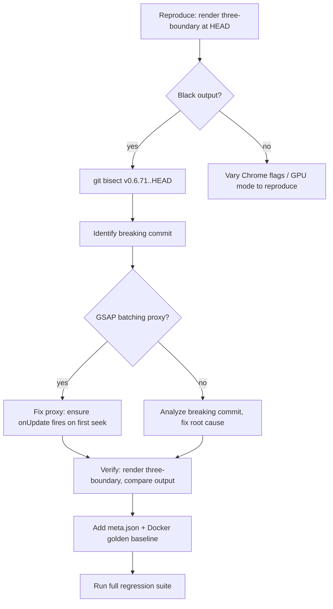

# fix: WebGL/Three.js content renders black in v0.6.80+ (issue #1260)

## Summary

Three.js/WebGL content renders correctly in `hyperframes preview` but produces black frames in `hyperframes render` starting at v0.6.80. The regression is confirmed across multiple reporter environments (macOS arm64, Chrome 148, 16 GB RAM). Fix the root cause and add a CI regression test so WebGL capture failures are caught before release.

## Problem Frame

A user reported (#1260) that Three.js backgrounds render black in the MP4 output. The regression was introduced between v0.6.71 (works) and v0.6.80 (broken). Preview continues to work because it runs in a normal browser window — no headless Chrome, no CDP screenshots, no injected producer stubs. The render pipeline injects an early stub (`HF_EARLY_STUB`) and a bridge script that mediate between the composition and the engine's capture loop.

The existing `three-boundary` test fixture in the producer has no `meta.json` and no golden baseline, so CI never actually validates WebGL capture — the fixture exists as source material only.

---

## Requirements

**Correctness**

- R1. Three.js/WebGL content must render correctly in `hyperframes render` output — matching the visual result of `hyperframes preview`.
- R2. The fix must not regress the GSAP batching behavior introduced in #1231 (compositions with thousands of `tl.to()` calls must still render without main-thread hang).
- R3. The fix must not regress existing producer regression tests (PSNR baselines must pass).

**Regression coverage**

- R4. A Three.js regression test with `meta.json` and Docker-generated golden baseline must be added so CI catches WebGL capture failures.

---

## Key Technical Decisions

**Root cause hypothesis: GSAP batching proxy.** Commit `ebd156bc` (v0.6.80) installs `HF_EARLY_STUB` — a property trap on `window.gsap` that wraps `gsap.timeline()` with a proxy. The proxy queues `to/from/fromTo/set/add` calls and flushes them via `requestAnimationFrame` in batches of 100. Three.js compositions register their `renderer.render()` call inside an `onUpdate` callback on a queued `to()` — the callback only reaches the real timeline after the batch flushes. While the proxy's `seek()` calls `flushPendingOperations()` synchronously before delegating to the real timeline, there's a window during initialization where the proxy might interfere with how init.ts binds the timeline and how the bridge reports `__hf.duration`. This hypothesis will be confirmed or refuted by the bisect in U1.

**Reproduce-first approach.** The user explicitly requested working backwards from a reproduction. The plan starts by reproducing the bug locally, then uses `git bisect` to identify the exact breaking commit, then fixes from there.

**Docker-generated baselines only.** Per CLAUDE.md, golden baselines for `packages/producer/tests/` must be generated inside `Dockerfile.test`, not on the host. The Three.js regression test baseline will follow this contract.

---

## High-Level Technical Design



---

## Scope Boundaries

### Deferred to Follow-Up Work

- Applying the micro-screenshot flush from closed PR #1264 as a defense-in-depth measure — the root cause fix should make this unnecessary, but it could be revisited as a hardening measure
- Extending WebGL capture tests to cover `captureScreenshotWithAlpha` and `captureAlphaPng` paths (HDR pipeline)
- Testing on Linux BeginFrame mode (unaffected per research — uses `HeadlessExperimental.beginFrame`, not `Page.captureScreenshot`)

---

## Implementation Units

### U1. Reproduce and bisect the regression

**Goal:** Confirm the bug reproduces locally and identify the exact breaking commit.

**Requirements:** R1

**Dependencies:** None

**Files:**
- `packages/producer/tests/distributed/three-boundary/src/index.html` (read only — existing fixture)
- `packages/engine/src/services/screenshotService.ts` (read only — verify capture params)

**Approach:** Run the existing `three-boundary` composition through the render pipeline at HEAD. If it produces black WebGL content, use `git bisect` between `v0.6.71` and `HEAD` with a scripted test that checks for non-black pixels in the output. The bisect script should render the composition and verify that the output contains non-zero color values in the WebGL canvas area. If the bug doesn't reproduce with the existing fixture, vary the Chrome GPU flags (`--gpu`, `--no-browser-gpu`) and capture mode to match the reporter's environment.

**Execution note:** This is an investigative unit — the output is the breaking commit hash, not code.

**Test scenarios:**
- Render `three-boundary` at HEAD → output frames should show purple cube (currently expected to be black, confirming the bug)
- Render `three-boundary` at v0.6.71 → output frames should show purple cube (confirming the baseline works)
- `git bisect` identifies a single commit as the first-bad

**Verification:** The bisect completes with a definitive commit hash. The breaking commit's diff is understood well enough to design a fix.

---

### U2. Fix the root cause

**Goal:** Patch the identified code so WebGL content renders correctly without regressing GSAP batching.

**Requirements:** R1, R2, R3

**Dependencies:** U1

**Files:** (depends on bisect result — most likely one of these)
- `packages/producer/stubs/hf-early-stub.ts`
- `packages/producer/src/services/fileServer.ts`
- `packages/core/src/runtime/init.ts`

**Approach:** The fix depends on the bisect result from U1. The most likely scenarios:

1. **GSAP batching proxy issue** — If the proxy interferes with Three.js `onUpdate` callbacks, the fix would ensure that the proxy's `flushPendingOperations()` properly applies all queued tweens before the first engine seek, OR that the proxy correctly handles the timeline binding flow in init.ts so `__renderReady` is set and the duration getter returns the correct value.

2. **`__renderReady` timing issue** — The GSAP batching commit removed `window.__renderReady = true` from the bridge's `waitForPlayer()` function. If init.ts doesn't set it in time for compositions that manually register timelines (like `three-boundary`), the duration getter's `if (!window.__renderReady) return 0` gate would prevent `pollHfReady` from resolving. The fix would ensure `__renderReady` is set correctly for all timeline registration patterns.

3. **Something else entirely** — The bisect may reveal a different commit. Fix based on what the investigation shows.

**Patterns to follow:** The existing `prepareFrameForCapture()` pattern in `frameCapture.ts` (line ~1266) already does a compositor-flush micro-screenshot for the shader transitions pipeline — if a compositor flush is needed, follow that pattern.

**Test scenarios:**
- Render `three-boundary` at HEAD with fix applied → purple cube visible in all frames
- Render a composition with 1000+ `tl.to()` calls → renders without timeout (GSAP batching still works)
- Existing producer regression tests pass (PSNR baselines)
- `hyperframes preview` still shows Three.js content correctly (no regression in preview path)

**Verification:** The `three-boundary` composition renders with visible WebGL content. No existing test regressions.

---

### U3. Add Three.js regression test to CI

**Goal:** Add `meta.json` and a Docker-generated golden baseline for the `three-boundary` fixture so CI validates WebGL capture on every release.

**Requirements:** R4

**Dependencies:** U2

**Files:**
- `packages/producer/tests/distributed/three-boundary/meta.json` (create)
- `packages/producer/tests/distributed/three-boundary/output/output.mp4` (generate via Docker)
- `Dockerfile.test` (verify it handles the Three.js fixture)

**Approach:** Create `meta.json` for the `three-boundary` test fixture with appropriate settings (320x180, 2s duration, fps matching other fixtures). Generate the golden baseline inside `Dockerfile.test` using:

```
bun run --cwd packages/producer docker:test:update three-boundary
```

The baseline must be generated inside Docker — not on the host — per CLAUDE.md. Verify that the regression harness picks up the fixture by checking `tryAddSuite()` no longer skips it.

**Patterns to follow:** Existing test fixtures in `packages/producer/tests/distributed/` — mirror the `meta.json` structure from a similar simple fixture.

**Test scenarios:**
- `three-boundary` fixture appears in the regression harness test list (not skipped for missing `meta.json`)
- PSNR comparison between rendered output and golden baseline passes within threshold
- Deliberately breaking WebGL capture (e.g., reverting the fix) causes the Three.js test to fail PSNR

**Test expectation:** The test is the golden baseline itself — CI runs the render and compares against the Docker-generated `output.mp4`.

**Verification:** The full regression test suite passes including the new `three-boundary` fixture. The fixture is not silently skipped.

---

## Risks & Dependencies

- **Bisect may not reproduce locally.** The reporter is on Chrome 148 / macOS arm64. If the local Chrome version differs, the bug might not reproduce. Mitigation: match Chrome version via Puppeteer's managed cache, or use `--gpu` / `--no-browser-gpu` flags to vary the GPU backend.
- **Docker baseline generation requires Docker running.** The golden baseline must be generated inside `Dockerfile.test`. If Docker isn't running on the dev machine, this step must be done remotely (e.g., on the devbox at `ubuntu@10.0.9.220`).
- **GSAP proxy fix may require careful threading.** If the root cause is in the proxy, the fix must preserve the batching behavior for large compositions while ensuring small compositions (especially those using `onUpdate` for WebGL) work correctly.
