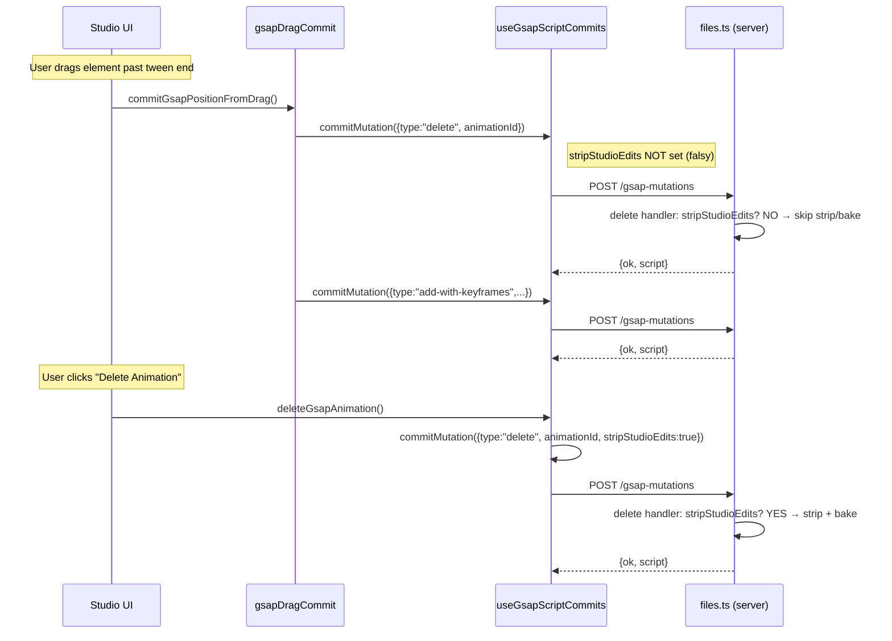

# fix: Gate server delete hooks and fix keyframe value corruption

## Summary

Make branch `fix/gesture-recording-offset-v2` merge-safe by fixing regressions it introduced: the build is broken (6 tsc errors), server-side strip/bake hooks fire destructively on extend-tween drags, the VISUAL_BASELINE block bakes cross-tween values into keyframes, and diagnostic logs need stripping.

---

## Problem Frame

The branch added four bug fixes for element position corruption after "Delete All Keyframes": server-side offset stripping, opacity baking on delete, baseline visual property capture during drag, and scale-aware identity matrix. A comprehensive audit then found that three of these fixes introduce new regressions:

1. The server `delete` handler fires `stripStudioEditsFromTarget` and `bakeVisibilityOnDelete` on *every* delete mutation — including the internal delete inside `extendTweenAndAddKeyframe`, which deletes-then-recreates the tween during drags outside the tween range. This bakes incorrect inline opacity and strips offsets mid-gesture, corrupting the saved file.

2. `readAllAnimatedProperties` rounds all declared animation properties to integers (`Math.round(val)` at line 64), so a drag mid-fade stores `opacity: 0` instead of `0.4`. The new VISUAL_BASELINE block uses 3-decimal precision but only runs for properties *not* already read — it never compensates for the integer rounding. Separately, VISUAL_BASELINE reads runtime values without checking whether other tweens are animating those properties, so mid-fade opacity from tween A gets baked into tween B's keyframes.

3. The build doesn't pass: 6 TypeScript errors in `gsapSoftReload.ts` from `as Record<string, unknown>` casts on Element-typed targets that need the double cast through `unknown`.

---

## Requirements

**Build & merge readiness**

- R1. `bunx tsc --noEmit` passes for `packages/studio` with zero errors.
- R2. All diagnostic log statements (`[HF:DRAG]`, `[HF:SOFT_RELOAD]`, `[HF:COMMIT]`, `[HF:MUTATION]`, `[HF:SERVER:DELETE]`) are removed before merge.

**Server delete hook gating**

- R3. `stripStudioEditsFromTarget` and `bakeVisibilityOnDelete` fire only on user-initiated animation deletes, not on internal delete-then-recreate operations.
- R4. User-level "Delete All Keyframes" and "Delete Animation" still strip offsets and bake opacity as before.

**Property read precision**

- R5. `readAllAnimatedProperties` uses per-property precision: integer rounding for positional properties (x, y, xPercent, yPercent), 3-decimal rounding for visual properties (opacity, scale, scaleX, scaleY, rotation).
- R6. The VISUAL_BASELINE block does not capture values that are being animated by a different timeline-registered tween on the same element (bare `gsap.to()` tweens outside `__timelines` are a known pre-existing gap per R-RISK-1).

**Opacity bake correctness**

- R7. `bakeVisibilityOnDelete` handles relative opacity values (e.g., `"+=0.5"`) without writing invalid CSS.
- R8. `bakeVisibilityOnDelete` scans all keyframes for the final effective opacity, not just the literal last keyframe object.

---

## Key Technical Decisions

- KTD-1. **Flag on the mutation type, not on the route or commit options.** The `delete` mutation type gains an optional `stripStudioEdits?: boolean` field. The server handler runs strip/bake only when `stripStudioEdits` is truthy. This is chosen over a route-level query parameter or a `commitMutation` option because the decision belongs to the mutation semantics, not the transport or the reload behavior. The flag defaults to `undefined` (falsy) so existing callers and the extend-tween path are safe without changes; only the user-level delete caller sets it to `true`.

- KTD-2. **Per-property precision map instead of a blanket rounding change.** A `POSITION_PROPS` set (`x`, `y`, `xPercent`, `yPercent`) gets integer rounding; everything else gets 3-decimal. This avoids changing the behavior of position reads (which are genuinely integer-pixel in GSAP) while fixing corruption of fractional visual properties.

- KTD-3. **VISUAL_BASELINE filters by checking all tweens on the element.** The guard queries `window.__timelines` to find all tweens targeting the element, collects their animated property sets, and skips any VISUAL_BASELINE property that appears in another tween's properties. This is a runtime check (not a cache lookup) because it needs to reflect the current timeline state at the moment of the drag commit.

- KTD-4. **Opacity bake scans all keyframes in reverse for the effective final opacity.** Walking keyframes from last to first and taking the first one that has an `opacity` property correctly handles cases where the 100% keyframe only has position properties but an earlier keyframe (e.g., 20%) set opacity. Relative values (`+=`, `-=`, `*=`) are detected by string prefix and skipped (the bake becomes a no-op for relative opacity, which is safer than writing invalid CSS).

---

## High-Level Technical Design

---

## Scope Boundaries

### In scope

- TypeScript build errors in `gsapSoftReload.ts`
- Server delete hook gating via mutation flag
- Property rounding precision in `readAllAnimatedProperties`
- VISUAL_BASELINE cross-tween guard
- `bakeVisibilityOnDelete` edge case hardening (relative values, keyframe scan)
- Diagnostic log removal from all files modified by this branch

### Deferred to Follow-Up Work

- Drag math: draft ignores GSAP base (§2.3 H1), falsy-zero doubles distance (H2), cancel paths don't restore gsap.set (H5) — pre-existing
- Soft reload: inline transform survives kill (§2.4 F1), stale offsets re-applied in live DOM (F3), MotionPathPlugin async (F4), bare tweens survive kill (F5) — pre-existing
- Drags on `from()`/`fromTo()` tweens are destructive (§2.5) — pre-existing
- Group/multi-element selector corruption (§3.1) — pre-existing
- Animation ID instability (§3.2) — pre-existing
- Percentage-space mismatches (§3.3) — pre-existing
- Error swallowing returning `ok: true` (§3.4) — pre-existing
- `_auto` 100%-keyframe drops properties (§3.5) — pre-existing
- Gesture recording regressions (§3.6) — partially from this branch but distinct feature surface
- `readGsapProperty` integer rounding (line 22) — pre-existing standalone function, not called during drag commit flow

---

## Implementation Units

### U1. Fix TypeScript build errors in gsapSoftReload.ts

**Goal:** Unbreak the build (R1 partial).

**Requirements:** R1

**Dependencies:** None — this unblocks all other work.

**Files:**
- `packages/studio/src/utils/gsapSoftReload.ts`

**Approach:** Six `as Record<string, unknown>` casts on `Element`-typed targets need `as unknown as Record<string, unknown>`. The Element type doesn't overlap with `Record<string, unknown>` so TypeScript rejects the direct assertion. Lines: 76, 77 (the `gsapCache` cast is fine), 88, 90, 120, 121.

**Patterns to follow:** The existing double-cast on line 79 (`as unknown as Record<string, unknown>`) is the correct pattern already used once in the same file.

**Test scenarios:**
- `bunx tsc --noEmit --project packages/studio/tsconfig.json` passes with zero errors after the fix

**Verification:** `bunx tsc --noEmit` for the studio package exits 0.

---

### U2. Gate server-side strip/bake hooks on user-level delete

**Goal:** Prevent `stripStudioEditsFromTarget` and `bakeVisibilityOnDelete` from firing on internal delete-then-recreate drags (R3, R4).

**Requirements:** R3, R4

**Dependencies:** U1

**Files:**
- `packages/core/src/studio-api/routes/files.ts` (delete handler, mutation type union)
- `packages/studio/src/hooks/useGsapScriptCommits.ts` (`deleteGsapAnimation` caller)

**Approach:** Add `stripStudioEdits?: boolean` to the delete mutation type union (line 655). In the delete case handler (line 847), wrap the strip/bake calls in `if (body.stripStudioEdits)`. In `deleteGsapAnimation` (the user-level delete), pass `stripStudioEdits: true` in the mutation payload. The `extendTweenAndAddKeyframe` path in `gsapDragCommit.ts` already sends a bare `{ type: "delete", animationId }` — it remains unchanged and the flag defaults to falsy.

**Patterns to follow:** Other optional mutation fields in the type union (e.g., `ease?: string` on add mutations).

**Test scenarios:**
- Delete animation via context menu: strip and bake fire (offset attributes removed, opacity baked)
- Drag element past tween end (extend-tween path): strip and bake do NOT fire; offsets survive; inline opacity unchanged
- Drag element within tween range: no delete mutation dispatched at all (existing behavior preserved)
- `removeAllKeyframes` mutation: no strip/bake (this is a `remove-all-keyframes` type, not `delete`)

**Verification:** Manual test with `bugbash-combined` project — drag `#bug-triangle` past tween end at t=2s, verify the rewritten tween preserves `ease: "none"` and does not bake inline opacity. Then delete the animation via context menu, verify offset stripped and opacity baked.

---

### U3. Fix property rounding precision in readAllAnimatedProperties

**Goal:** Prevent integer rounding from corrupting opacity, scale, and rotation values during drag commits (R5).

**Requirements:** R5

**Dependencies:** U1

**Files:**
- `packages/studio/src/hooks/gsapRuntimeReaders.ts`

**Approach:** Define a `POSITION_PROPS` set containing `x`, `y`, `xPercent`, `yPercent`. In the main property-reading loop (lines 62-65), use integer rounding only for properties in `POSITION_PROPS`; use `Math.round(val * 1000) / 1000` for all others. This aligns the declared-property loop with the VISUAL_BASELINE block's precision.

**Patterns to follow:** The VISUAL_BASELINE block already uses `Math.round(val * 1000) / 1000` for 3-decimal precision.

**Test scenarios:**
- Read `opacity: 0.4` mid-fade → returns `0.4`, not `0`
- Read `scale: 1.35` → returns `1.35`, not `1`
- Read `rotation: 45.7` → returns `45.7`, not `46`
- Read `x: 150.3` → returns `150` (integer, position prop)
- Read `y: 0` → returns `0` (integer, position prop)
- Existing `manualOffsetDrag.test.ts` tests continue to pass (11/11)

**Verification:** `bun test --filter manualOffsetDrag` passes. Manual drag of a mid-fade element preserves opacity in the committed keyframe.

---

### U4. Guard VISUAL_BASELINE against cross-tween contamination

**Goal:** Prevent the baseline capture from baking opacity/scale values from other tweens into the drag target's keyframes (R6).

**Requirements:** R6

**Dependencies:** U1, U3

**Files:**
- `packages/studio/src/hooks/gsapRuntimeReaders.ts`

**Approach:** Before the VISUAL_BASELINE loop, collect the set of properties animated by *other* tweens targeting the same element. Query `iframe.contentWindow.__timelines` to iterate all timelines, find children targeting `selector`, and collect their animated property keys — excluding the current `anim.id`. In the VISUAL_BASELINE loop, skip any property that appears in this "animated elsewhere" set.

The check is runtime-only (no cache dependency) because it must reflect the current timeline state at drag-commit time. The timeline iteration is O(tweens × targets) but Studio elements rarely have more than a handful of tweens, so this is negligible.

**Patterns to follow:** `gsapRuntimeBridge.ts` already iterates `__timelines` children to find animations for an element — similar traversal pattern.

**Test scenarios:**
- Element with tween A (opacity fade 0→1) and tween B (x position): dragging tween B does NOT capture `opacity` from tween A's runtime state
- Element with only one tween animating opacity: VISUAL_BASELINE correctly captures opacity when it's not in the tween's declared properties but differs from default
- Element with no other tweens: VISUAL_BASELINE captures all non-default visual properties as before
- Element with tween A animating `scale` and tween B animating `x`: dragging tween B does NOT capture `scale`, `scaleX`, or `scaleY` from tween A

**Verification:** Console-check property reads during a drag on a multi-tween element — baseline capture excludes other-tween properties.

---

### U5. Harden bakeVisibilityOnDelete edge cases

**Goal:** Fix `bakeVisibilityOnDelete` to handle relative opacity values and multi-keyframe opacity lookup (R7, R8).

**Requirements:** R7, R8

**Dependencies:** U2 (this function is now only called on user-level deletes, but the correctness fixes apply regardless)

**Files:**
- `packages/core/src/studio-api/routes/files.ts`

**Approach:**

For R8 — scan keyframes in reverse for the effective final opacity: replace the current "check only the last keyframe" logic with a reverse walk. Starting from the last keyframe, iterate backwards and take the first keyframe whose `properties` includes `opacity`. This correctly handles `{"0%":{opacity:0}, "20%":{opacity:1}, "100%":{x:500}}` by finding `opacity:1` at 20%.

For R7 — guard against relative values: after extracting `finalOpacity`, check if it's a string starting with `+=`, `-=`, or `*=`. If so, skip the bake (return early). Also add a `Number.isFinite` check after `Number(finalOpacity)` to catch any NaN that slips through.

**Patterns to follow:** The existing guard `if (finalOpacity == null || Number(finalOpacity) === 0) return;` is the right shape — the fix extends it.

**Test scenarios:**
- Keyframes `{0%: {opacity:0}, 20%: {opacity:1}, 100%: {x:500}}` → bakes `opacity: 1` (found at 20%, not missing from 100%)
- Keyframes `{0%: {opacity:0}, 100%: {opacity:1}}` → bakes `opacity: 1` (existing behavior preserved)
- Keyframes `{0%: {x:0}, 100%: {x:500}}` → no bake (no opacity in any keyframe)
- Relative opacity `"+=0.5"` → no bake (skip rather than write invalid CSS)
- Flat `to({opacity: 1})` → bakes `opacity: 1` (existing behavior preserved)
- Descending opacity `{0%: {opacity:1}, 50%: {opacity:0}, 100%: {x:500}}` → bakes `opacity: 0` (reverse-scan finds opacity at 50%, which is the correct final visual state after fade-out)
- `from({opacity: 0})` tween → no bake (method is `from`, final state is CSS state — existing skip)

**Verification:** Unit-level review of the function behavior against each scenario.

---

### U6. Strip diagnostic logs from all modified files

**Goal:** Remove all debug logging added by this branch before merge (R2).

**Requirements:** R2

**Dependencies:** U1, U2, U3, U4, U5 (strip after all other changes to avoid merge conflicts)

**Files:**
- `packages/studio/src/utils/gsapSoftReload.ts` — remove all `[HF:SOFT_RELOAD]` console.log/warn calls
- `packages/studio/src/components/editor/manualOffsetDrag.ts` — remove all `[HF:DRAG]` console.log calls
- `packages/studio/src/hooks/useGsapScriptCommits.ts` — remove all `[HF:COMMIT]` and `[HF:MUTATION]` console.log calls
- `packages/core/src/studio-api/routes/files.ts` — remove `[HF:SERVER:DELETE]` console.log call

**Approach:** Grep for `[HF:` prefix across all four files and remove each log statement. Some log statements span multiple lines (template literals with object dumps) — remove the entire statement including any preceding `const` that exists solely for the log.

**Patterns to follow:** The codebase convention is zero diagnostic logging in production code. Logs belong in test harnesses only.

**Test scenarios:**
- `grep -r "\[HF:" packages/studio/src packages/core/src` returns zero matches after cleanup
- `bunx tsc --noEmit` still passes (no orphaned variables from removed log statements)
- `bun test --filter manualOffsetDrag` still passes

**Verification:** Grep confirms zero `[HF:` matches. Build passes. Tests pass.

---

## Risks & Dependencies

- R-RISK-1. The VISUAL_BASELINE cross-tween guard (U4) depends on `__timelines` being populated. If a tween is registered outside `__timelines` (bare `gsap.to()` not on a timeline), it won't be detected. This is a known pre-existing limitation (§2.4 F5 in the audit) and is out of scope for this fix.

- R-RISK-2. The `bakeVisibilityOnDelete` reverse-scan (U5) changes the semantics of which keyframe is consulted for the baked opacity. If an animation has descending opacity (fade out), the bake will now pick the last keyframe with opacity rather than the literal last keyframe — which may be at 50% with `opacity: 0.5`. This is strictly more correct than the current behavior (which would miss opacity entirely if the 100% keyframe lacks it) but worth verifying against the test project.

---

## Sources & Research

- Audit document: `studio-keyframes-bug-audit.md` (root) — comprehensive findings with live runtime verification
- Handoff document: `handoff-gsap-drag-delete-v2.md` (root) — session 2 bug descriptions and fix history
- Delete handler: `packages/core/src/studio-api/routes/files.ts:847-854`
- Extend-tween delete dispatch: `packages/studio/src/hooks/gsapDragCommit.ts:131-135`
- Property reading with rounding: `packages/studio/src/hooks/gsapRuntimeReaders.ts:62-80`
- TypeScript errors: `packages/studio/src/utils/gsapSoftReload.ts:76,77,88,90,120,121`
- Diagnostic logs: grep `[HF:` across gsapSoftReload.ts, manualOffsetDrag.ts, useGsapScriptCommits.ts, files.ts
