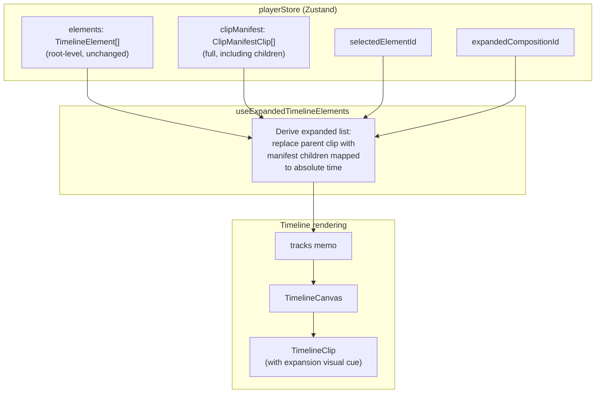
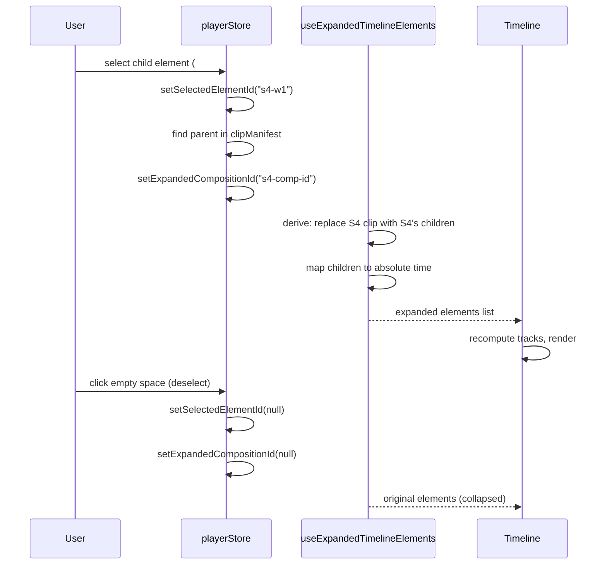

# feat: Timeline inline sub-composition expansion with Studio cleanup

## Summary

When a child element inside a sub-composition is selected, the timeline replaces the parent clip with the deepest-level siblings positioned at absolute master-timeline coordinates. Deselecting or selecting outside collapses back. This PR also fixes O(n²) GSAP element matching and adds missing memoization in PropertyPanel.

---

## Problem Frame

Sub-compositions appear as opaque blocks in the timeline — selecting a child element inside one (e.g., `#s4-w1` inside S4) still shows S4 as a single clip, giving no visibility into the child's timing. The existing drill-down (`useCompositionStack`) replaces the entire iframe with the sub-comp's content, which is a heavyweight operation that loses the master preview context and isn't what users want when they just need to see where children sit in the master timeline.

Separately, the Studio codebase has accumulated performance debt: an O(n²) loop in `isElementGsapTargeted` that runs per-element per-render, and un-memoized DOM reads in PropertyPanel that fire on every render cycle.

---

## Requirements

**Inline expansion**

- R1. When a child element inside a sub-composition is selected, the timeline replaces the parent clip with all siblings at that depth level
- R2. Expanded children are positioned at absolute master-timeline coordinates (verify whether manifest provides absolute or local times — see KTD-4)
- R3. Children are clamped to the parent clip's time bounds — no child clip extends past `parentClip.start + parentClip.duration`
- R4. Deselecting (click empty space, Escape) or selecting an element outside the sub-composition collapses back to the parent clip
- R5. Recursive expansion: selecting inside a nested sub-composition (S4 > S4-inner > element) shows only the deepest-level siblings
- R6. Expanded children have a minimalist visual distinction from top-level clips (subtle, not distracting)
- R7. The existing full drill-down (double-click to enter sub-comp) remains available and unchanged

**Code quality**

- R8. Eliminate O(n²) `isElementGsapTargeted` loop via Set-based index
- R9. Memoize expensive GSAP runtime reads in PropertyPanel

---

## Key Technical Decisions

- KTD-1. **Source of child clip data: clip manifest, not DOM re-parsing.** The iframe runtime exposes `__clipManifest` with ALL clips including sub-comp children (with `parentCompositionId` linking them). Currently `processTimelineMessage` filters these out (lines 70-73 of `useTimelineSyncCallbacks.ts`). We store the full manifest in playerStore and derive expanded elements from it — no DOM queries needed for expansion.

- KTD-2. **Expansion is a computed view, not a store mutation.** The `elements` array in playerStore stays unchanged (root-level clips). A `useExpandedTimelineElements` hook derives the expanded list by merging expansion state with the stored manifest. This keeps collapse trivial (just clear expansion state) and avoids corrupting the canonical element list.

- KTD-3. **Expansion state keyed by parent composition ID.** Store `expandedCompositionId: string | null` in playerStore — the composition whose children are currently displayed inline. When `selectedElementId` changes to a sub-comp child, set this to the parent's composition ID; on deselect/select-outside, clear it. For recursive nesting, this becomes the deepest expanded parent.

- KTD-4. **Time mapping — verify coordinate space at implementation time.** The runtime's `startResolver.ts` may already add parent offsets to child clip starts, making manifest `start` values absolute. If so, use `child.start` directly (not `parentClip.start + child.start`). If manifest values are local, apply `parentClip.start + child.start`. Verify by logging a sub-comp's child manifest entries and comparing to the parent's start. Clamping (R3) always compares against `[parentClip.start, parentClip.start + parentClip.duration]` regardless of coordinate space. No time-stretching for v1.

- KTD-5. **Visual distinction: tinted left border on expanded clips.** A 2px colored left border on expanded clips distinguishes them from top-level clips without adding clutter. Color derived from the parent clip's track style. No indentation (would break timeline alignment), no extra labels (would crowd small clips).

---

## High-Level Technical Design

**Selection → Expansion flow:**

---

## Scope Boundaries

### Deferred to Follow-Up Work

- Time-stretching support for sub-comps with `playbackRate !== 1`
- Drag/resize editing of expanded child clips in the inline view
- Expanding multiple sub-compositions simultaneously
- Splitting large hooks (useDomEditCommits 594 LOC, useDomEditSession 575 LOC, useGsapScriptCommits 567 LOC) — worthwhile but out of scope for this PR
- Granular error boundaries around timeline/sidebar/editor subsections
- PropertyPanel component splitting (594 LOC, 56 props)

---

## Implementation Units

### U1. Store full clip manifest in playerStore

- **Goal:** Preserve the unfiltered clip manifest so expansion can look up sub-comp children without re-querying the iframe DOM
- **Requirements:** R1, R2, R5 (provides the data layer)
- **Dependencies:** None
- **Files:**
  - `packages/studio/src/player/store/playerStore.ts` — add `clipManifest`, `expandedCompositionId`, setters
  - `packages/studio/src/player/hooks/useTimelineSyncCallbacks.ts` — store full manifest before filtering
- **Approach:** Add `clipManifest: ClipManifestClip[] | null` and `setClipManifest` to the store. In `processTimelineMessage`, call `setClipManifest(data.clips)` before the existing root-level filter. Add `expandedCompositionId: string | null` and `setExpandedCompositionId` for expansion state. Include both in `reset()`.
- **Patterns to follow:** Existing store shape — flat state with dedicated setters, same pattern as `elements`/`setElements`
- **Test scenarios:**
  - Store accepts and returns full clip manifest with both root and child clips
  - `reset()` clears `clipManifest` to null and `expandedCompositionId` to null
  - `setClipManifest` replaces previous value entirely (not merge)
- **Verification:** Build passes, existing timeline tests still pass — this is additive-only

---

### U2. Create useExpandedTimelineElements hook

- **Goal:** Derive the expanded element list from store state — the core logic that replaces parent clips with children when expansion is active
- **Requirements:** R1, R2, R3, R4, R5
- **Dependencies:** U1
- **Files:**
  - `packages/studio/src/player/hooks/useExpandedTimelineElements.ts` (new)
  - `packages/studio/src/player/hooks/useExpandedTimelineElements.test.ts` (new)
- **Approach:** The hook reads `elements`, `clipManifest`, `selectedElementId`, and `expandedCompositionId` from the store. When `expandedCompositionId` is set:
  1. Find the parent TimelineElement whose `compositionSrc` matches or whose manifest entry's `compositionId` matches the expanded ID
  2. Find all manifest clips whose `parentCompositionId` equals the expanded composition ID
  3. Map each child clip to a TimelineElement with absolute timing (`parent.start + child.start`, clamped to parent bounds per R3)
  4. Return new elements array with parent replaced by mapped children
  5. For recursive nesting (R5): if the selected element is inside a nested sub-comp, only expand the deepest parent composition whose children contain the selected element — intermediate ancestors are NOT expanded, only the deepest-level siblings are displayed
  6. Mark expanded children with `expandedFromParent: string` (parent's element key) for visual distinction
- **Patterns to follow:** Pure derivation hook like the existing `tracks` useMemo in Timeline.tsx — compute from store selectors, return stable reference via useMemo
- **Test scenarios:**
  - No expansion active: returns elements unchanged
  - Single-level expansion: parent clip replaced by 3 children with correct absolute timing
  - Child timing clamped to parent bounds: child starting before parent.start is clamped, child extending past parent end is truncated
  - Child completely outside parent bounds is excluded
  - Recursive expansion: S4 > S4-inner > element only shows S4-inner's children
  - Selecting an element outside the expanded sub-composition collapses expansion and re-shows parent clip
  - Deselect clears expansion: returns to original elements
  - Empty manifest or no matching children: skip expansion silently, keep parent clip visible (no crash, no blank gap)
  - Parent with `playbackStart` offset: children still use parent.start as base
- **Verification:** Unit tests pass for all scenarios above

---

### U3. Wire expansion into Timeline and manage selection-driven state

- **Goal:** Replace the raw elements with expanded elements in Timeline rendering, and auto-set/clear `expandedCompositionId` when selection changes
- **Requirements:** R1, R4, R7
- **Dependencies:** U1, U2
- **Files:**
  - `packages/studio/src/player/components/Timeline.tsx` — use expanded elements for tracks memo, keep raw elements for effectiveDuration
  - `packages/studio/src/player/components/TimelineCanvas.tsx` — pass expansion metadata to clips
  - `packages/studio/src/player/hooks/useExpandedTimelineElements.ts` — add expansion sync useEffect (co-located with derivation hook from U2)
  - `packages/studio/src/components/nle/NLELayout.tsx` — clear expandedCompositionId before drill-down in handleDrillDown
- **Approach:**
  - In Timeline.tsx, keep `const rawElements = usePlayerStore((s) => s.elements)` for `effectiveDuration` computation. Add a separate `const expandedElements = useExpandedTimelineElements()` and use it for the `tracks` memo input. Two selectors, two purposes.
  - Expansion state management lives inside `useExpandedTimelineElements` (or a sibling `useExpansionSync` hook), NOT in NLELayout. The hook uses a `useEffect` watching `selectedElementId` and `clipManifest` to auto-set/clear `expandedCompositionId`. This keeps the logic co-located with the expansion derivation and independently testable. `selectedElementId` is set from many call sites (Timeline, TimelineCanvas, useDomEditSession, App.tsx) — a store subscription catches all of them.
  - The existing `onDrillDown` (double-click) continues to use `useCompositionStack` unchanged (R7). Entering drill-down always clears `expandedCompositionId` first.
  - Playhead position and scrubbing behavior are unchanged during expansion — the master timeline playhead renders over expanded children at master time positions.
  - Expanded children inherit the parent's track row. Multiple children on different sub-comp tracks collapse to the parent's single track row for v1.
- **Patterns to follow:** Store subscription pattern — useEffect watching Zustand selectors, same approach as existing `requestedSeekTime` handling
- **Test scenarios:**
  - Selecting a child element inside a sub-comp triggers expansion — parent clip disappears, children appear
  - Selecting an element outside the sub-comp collapses expansion
  - Pressing Escape deselects and collapses
  - Double-clicking a sub-comp clip still triggers the existing drill-down, not expansion
  - Double-clicking while expansion is active clears expansion before drill-down fires
  - Selecting between two different sub-comp children (same parent) keeps expansion active
  - Selecting a child in a different sub-comp switches expansion to the new parent
  - effectiveDuration uses raw elements and is unaffected by expansion state
- **Verification:** Manual testing in browser — select child in layers panel, verify timeline swaps clips; deselect, verify collapse

---

### U4. Minimalist visual distinction for expanded clips

- **Goal:** Visually differentiate expanded children from top-level clips with a subtle cue
- **Requirements:** R6
- **Dependencies:** U2, U3
- **Files:**
  - `packages/studio/src/player/components/TimelineClip.tsx` — render left border when expanded
  - `packages/studio/src/player/components/TimelineCanvas.tsx` — pass `isExpanded` flag to clips
  - `packages/studio/src/player/store/playerStore.ts` — extend TimelineElement with optional `expandedFromParent`
- **Approach:** Add optional `expandedFromParent?: string` field to TimelineElement (set by the expansion hook in U2). In TimelineClip, when this field is truthy, render a 2px left border using the track's accent color at 60% opacity. No indentation, no extra labels — the border is enough to signal "this clip was expanded from a parent."
- **Patterns to follow:** Existing conditional styling in TimelineClip — the `isSelected` and `isHovered` states already modify clip appearance
- **Test scenarios:**
  - Expanded clips render with left border, top-level clips do not
  - Border color derives from track accent (not hardcoded)
  - Very short clips still show visible border (2px minimum)
  - Test expectation: none — visual verification only
- **Verification:** Visual inspection in browser — expanded clips have subtle left border, top-level clips don't

---

### U5. Fix O(n²) isElementGsapTargeted with Set-based index

- **Goal:** Eliminate the triple-nested loop in `isElementGsapTargeted` that checks every element against every GSAP timeline target
- **Requirements:** R8
- **Dependencies:** None (independent of expansion feature)
- **Files:**
  - `packages/studio/src/hooks/useDomEditCommits.ts` — replace loop with Set lookup
- **Approach:** Build a `Set<string>` of GSAP-targeted element IDs once when timelines change (read `__timelines` from iframe, collect all target element IDs into a Set). Replace the `isElementGsapTargeted` function body with a `gsapTargetSet.has(elementId)` lookup. The Set is rebuilt when timelines change, cached in a ref between renders.
- **Patterns to follow:** Existing ref-caching pattern in useDomEditCommits for iframe-derived data
- **Test scenarios:**
  - Element inside a GSAP timeline is detected as targeted (same behavior as before)
  - Element not in any GSAP timeline returns false
  - Set is rebuilt when iframe timelines change (e.g., after soft reload)
  - Performance: O(1) lookup per element vs. previous O(n×m) nested loop
- **Verification:** Build passes, no regressions in drag/edit behavior, measurable reduction in timeline hover/select latency with many GSAP elements

---

### U6. Memoize expensive PropertyPanel GSAP reads

- **Goal:** Stop re-running DOM reads on every render cycle in PropertyPanel
- **Requirements:** R9
- **Dependencies:** None (independent of expansion feature)
- **Files:**
  - `packages/studio/src/components/editor/PropertyPanel.tsx` — wrap reads in useMemo
- **Approach:** The calls to `readGsapRuntimeValuesForPanel()` and `readGsapBorderRadiusForPanel()` (around lines 231-243) run on every render. Wrap each in `useMemo` keyed on `selectedElementId` and `currentTime` — these are the only inputs that change the read results. Leave the existing `forceRender` / `liveTime.subscribe` pattern unchanged — it is a working 30fps throttle that bridges non-React pub-sub with React rendering, not an anti-pattern.
- **Patterns to follow:** Existing useMemo patterns in Timeline.tsx for derived computations
- **Test scenarios:**
  - GSAP runtime values update when selectedElementId changes
  - Values update when currentTime changes (playhead scrub)
  - Values do NOT re-read when unrelated props change (e.g., panel resize)
  - Border radius values still display correctly after memoization
- **Verification:** Build passes, PropertyPanel still shows correct values during playback and scrubbing

---

## Sources & Research

- `packages/studio/src/player/lib/playbackTypes.ts` — `ClipManifestClip` has `parentCompositionId` linking children to parent compositions, and timing in local sub-comp space
- `packages/studio/src/player/hooks/useTimelineSyncCallbacks.ts:70-73` — the root-level filter that currently excludes sub-comp children
- `packages/studio/src/components/nle/useCompositionStack.ts` — existing drill-down mechanism (stays unchanged)
- `packages/studio/src/player/store/playerStore.ts` — Zustand store structure, selection state, elements array
- `packages/studio/src/hooks/useDomEditCommits.ts:47-72` — O(n²) `isElementGsapTargeted` loop
- `packages/studio/src/components/editor/PropertyPanel.tsx:231-243` — un-memoized GSAP DOM reads
