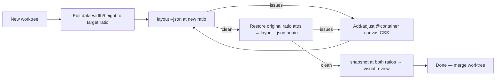

# feat: Responsiveness skill — aspect-ratio change best practices for agents

## Summary

Give agents a documented, verifiable workflow for adapting a hyperframes composition to a different canvas aspect ratio (16:9 → 9:16 → 1:1) — **without modifying the core framework, CLI, or runtime**. Everything needed already exists: the aspect change is an edit to `data-width`/`data-height` on the root element, ratio-conditional styling is achievable with authored CSS container queries (the composition makes its own root a query container — plain CSS, no runtime support required), and `hyperframes layout` + `hyperframes snapshot` already audit/screenshot at whatever size the file declares, giving the agent a mechanical self-verification loop. The deliverable is a `skills/responsive` skill encoding these best practices plus reconciliation of existing skill guidance that currently teaches anti-responsive fixed-dimension patterns.

---

## Problem Frame

Compositions declare a fixed canvas; the only adaptation today is uniform scale-to-fit (letterboxing), never reflow. Producing a 9:16 version of a 16:9 video means hand-editing with no guidance and no guardrails. From the Slack thread: layout must genuinely rearrange (like a responsive website), the main risk is an agent silently mangling the layout, so the workflow must include self-verification in an isolated worktree. Per scope decision: no framework changes — best-practices guidance for the agent is the deliverable.

## Requirements

- R1: An agent following the skill can retrofit an existing composition to a new aspect ratio using only authored HTML/CSS edits and existing CLI tooling.
- R2: The workflow includes mandatory mechanical verification (`hyperframes layout` clean at the new ratio AND the original ratio) and visual verification (`hyperframes snapshot` frames reviewed at both ratios), performed in an isolated worktree.
- R3: The skill documents ratio-conditional CSS patterns that work identically across preview, studio, producer capture, and player.
- R4: Existing skill guidance that contradicts responsiveness (`skills/tailwind` fixed-dimension advice, `skills/hyperframes` fixed-px patterns) is reconciled to point at the responsive path when multi-ratio output is needed.

## Key Technical Decisions

1. **No framework changes — authored CSS container queries.** Media queries key off the viewport, which in studio/player iframes is the scaled container, not the canvas — they'd behave differently across surfaces. Instead the skill teaches the composition to declare its own root a named size container in its own stylesheet (`[data-composition-id] { container-type: size; container-name: canvas; }`) and write `@container canvas (max-aspect-ratio: 1/1) { ... }` rules. This is plain CSS the runtime already honors everywhere (the runtime sizes the root from `data-width`/`data-height` inline, which gives the container a definite size — verified in `packages/core/src/runtime/init.ts` `applyCompositionSizing()`). Container queries are supported in capture Chrome (≥105) and all evergreen browsers.
2. **The aspect change itself is a two-attribute edit.** Rewrite `data-width`/`data-height` on the root composition element (and `data-resolution`/`data-composition-width|height` on `<html>` when present — see `packages/core/src/parsers/htmlParser.ts` resolution chain). The skill documents exactly which attributes to touch and warns that studio snaps arbitrary sizes to the six `CANVAS_DIMENSIONS` presets, so agents should target preset dimensions (1920x1080, 1080x1920, 1080x1080, 4K variants) unless told otherwise.
3. **Verification reuses existing commands unmodified.** `hyperframes layout <file> --json` audits overflow/overlap at the file's declared canvas size; `hyperframes snapshot` captures frames at that size. Checking *both* ratios means running the loop once per ratio with the attributes set accordingly (the new-ratio file in the worktree, the original via the untouched base checkout or by temporarily flipping the attributes back). No `--canvas` flag, no new command.
4. **Worktree isolation is the agent's own primitive.** The skill instructs: do the retrofit in a fresh worktree, gate completion on clean audits + reviewed snapshots, only then merge back. No bespoke tooling.

---

## High-Level Technical Design

The retrofit loop the skill encodes:



Author-facing CSS convention (directional, lives in the skill):

```text
[data-composition-id="root"] { container-type: size; container-name: canvas; }

@container canvas (max-aspect-ratio: 1/1) {
    .hero { flex-direction: column; }
}
```

---

## Implementation Units

### U1. `skills/responsive` skill

**Goal:** An agent can take a finished composition to a new ratio safely, end to end.
**Requirements:** R1, R2, R3
**Dependencies:** none
**Files:** `skills/responsive/SKILL.md` (new), optional `skills/responsive/references/` for the worked example, `CLAUDE.md` (skills paragraph mention).
**Approach:** Skill content, in order:
1. *Conventions*: the container-query setup from KTD 1; the existing `--comp-width`/`--comp-height` CSS variables (already set by the runtime) for `calc()`/JS consumers; prefer %/flex/grid/`cqw`/`cqh` units over canvas-pixel literals.
2. *Aspect change procedure*: exactly which attributes to edit (KTD 2), preset dimension table, studio-snapping caveat.
3. *Rearrangement patterns*: row→column stacks, caption repositioning, crop-vs-reflow decisions for media, safe-area thinking for portrait.
4. *Animation caveat (loud)*: GSAP keyframes recorded in px against one ratio won't follow a reflowed layout — prefer transforms relative to final layout or %-based values; `gsap.matchMedia()` keys off viewport, not canvas, so gate ratio-conditional animation on the `--comp-*` variables or `data-width`/`data-height` instead.
5. *Verification loop (hard gate)*: the worktree flow from the HTD diagram — not done until `hyperframes layout --json` is clean at **both** the target and original ratio and snapshots at both ratios have been visually reviewed.
Follow the structure of existing skills (`skills/hyperframes`: SKILL.md + references); pass `scripts/lint-skills.ts`.
**Test expectation: none — documentation/skill content.** Validated by `bun run lint:skills` plus a manual end-to-end worked example: retrofit one real composition (e.g. a `registry/blocks/` entry) from 16:9 to 9:16 following the skill verbatim, achieving clean audits at both ratios; capture it as the skill's worked example.
**Verification:** `bun run lint:skills` passes; worked example produces clean `layout --json` output at 1920x1080 and 1080x1920.

### U2. Reconcile existing anti-responsive guidance

**Goal:** No skill contradicts the new convention.
**Requirements:** R4
**Dependencies:** U1
**Files:** `skills/tailwind/SKILL.md`, `skills/hyperframes/SKILL.md`, `skills/gsap/SKILL.md`.
**Approach:** Soften the fixed-dimension advice in `skills/tailwind` (line ~108: fixed dims are fine for single-ratio work; point to `/responsive` for multi-ratio). Update the `skills/hyperframes` container guidance (line ~97) to mention the canvas container-query convention. In `skills/gsap`, add the matchMedia-vs-canvas caveat cross-referencing `/responsive`.
**Test expectation: none — documentation.** `bun run lint:skills` passes.
**Verification:** grep confirms the old fixed-dimension advice now references the responsive path.

---

## Scope Boundaries

**In scope:** the `skills/responsive` skill and reconciled cross-skill guidance. Nothing else.

**Out of scope (true non-goals):**
- Any change to `packages/core`, `packages/cli`, runtime, producer, engine, player, or studio — explicit scope decision.
- Automatic content rearrangement — layout decisions stay with the author/agent.
- Bespoke worktree machinery — agents bring their own isolation.

**Deferred to follow-up work (only if the skill proves insufficient in practice):**
- `--canvas` override flag for `layout`/`snapshot` (audit multiple ratios without attribute flipping).
- `hyperframes aspect` command (deterministic attribute rewrite + damage report).
- Runtime-applied container setup (so compositions don't need the one-line CSS).
- Lint rule warning on ratio-fragile patterns.
- First-class arbitrary canvas sizes in studio (today snapped to six presets).

## Risks (verified during planning)

- **Container queries across surfaces:** verified — the runtime sets inline root width/height from the data attributes in every surface (`applyCompositionSizing()`, `packages/core/src/runtime/init.ts:226`), giving the authored container a definite size; the producer's inline-style injection (`packages/producer/src/services/htmlCompiler.ts` ~line 624) only adds width/height px and never touches container properties. Capture Chrome supports container queries.
- **Attribute-flip verification is manual:** checking the original ratio requires flipping `data-width`/`data-height` back (or auditing the base checkout). Slightly clunky but tool-free; the deferred `--canvas` flag removes the clunk later if needed.
- **Animations vs. layout:** GSAP px keyframes won't follow reflowed layouts; the skill's animation section is the mitigation. Tooling support deferred.

## Sources & Research

- Slack thread (Sauce/James/Miguel, 2026-06-11): layout must rearrange like a responsive site; agent self-verification in a worktree required; scope decision — no core framework changes, best-practices skill only.
- Repo research: runtime sizing + CSS vars (`packages/core/src/runtime/init.ts`), resolution attribute chain (`packages/core/src/parsers/htmlParser.ts`), audit tooling (`packages/cli/src/commands/layout.ts`, `snapshot.ts`), skills structure (`skills/`), conflicting guidance (`skills/tailwind/SKILL.md` ~108, `skills/hyperframes/SKILL.md` ~97).
